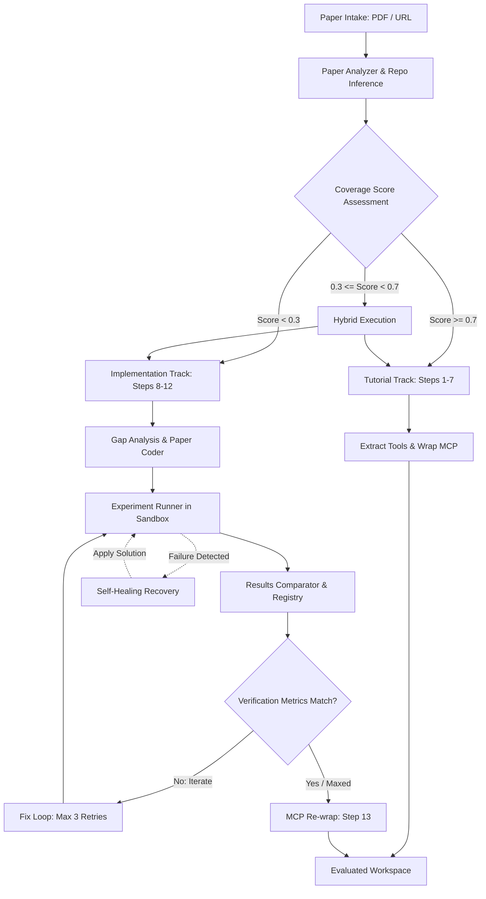

<p align="center">
  
</p>

<p align="center">
  <strong>An Autonomous Agent Orchestration Platform to Replicate, Implement, and Validate Research Papers.</strong>
</p>

<p align="center">
  <a href="https://github.com/ashishpatill/Paper2Agent/stargazers"></a>
  <a href="https://github.com/ashishpatill/Paper2Agent/network/members"></a>
  <a href="LICENSE"></a>
  <br/>
  <a href="https://nextjs.org"></a>
  <a href="https://www.typescriptlang.org/"></a>
  <a href="https://www.python.org/"></a>
  <a href="https://www.docker.com/"></a>
</p>

---

## 🌟 Overview

**Paper2Agent Studio** is a local-first workbench that turns scientific literature into functional, verified code. By extending the original research-agent pipeline, it introduces a robust Next.js orchestration application, Docker sandboxing, automatic dataset acquisition, and a self-healing iteration loop.

Whether a paper has an existing codebase with missing tools, or requires writing experiments entirely from scratch, Paper2Agent Studio automatically routes, generates, and validates the implementation.

---

## 🚀 Key Features

| Feature | Description |
| :--- | :--- |
| 🖥️ **Local-First Web Studio** | A sleek, responsive Next.js dashboard to upload PDFs/URLs, configure API keys locally, queue runs, and inspect detailed live outputs. |
| 🔀 **Two-Track Intelligent Routing** | Computes a codebase coverage score to dynamically run the **Tutorial Track** (tool extraction) or the **Implementation Track** (direct experiment coding). |
| 🩺 **Self-Healing Pipeline Recovery** | An autonomous debugger that classifies pipeline failures into 10 categories (e.g., NaN/Inf, missing dependencies, runtime errors) and automatically executes targeted solutions. |
| 📦 **Dataset Auto-Acquisition** | Automatically resolves and caches datasets from Hugging Face, Kaggle, Zenodo, UCI, or falls back to synthetic proxy data generators. |
| 🧠 **Cross-Run Evolution Store** | A persistent learning database that transfers lessons, prompts, and skill updates from past executions to optimize future runs. |
| 🛡️ **Docker Execution Sandbox** | Runs generated code in isolated, resource-constrained environments with strict network policies to prevent execution side-effects. |
| 🔍 **Anti-Fabrication Registry** | A verification ledger that traces every reported metric directly to execution artifacts to prevent LLM metric hallucination. |

---

## 📐 Architecture & Execution Flow

Paper2Agent Studio operates on a unified agentic feedback loop:



---

## ⚡ Quick Start

### 📋 Prerequisites

Ensure you have the following installed on your local machine:
- **Node.js** 20+
- **Python** 3.10+
- **Docker** (optional, recommended for sandboxed execution)
- **Claude CLI** (installed and authenticated)

### ⚙️ Installation

1. **Clone the repository:**
   ```bash
   git clone https://github.com/ashishpatill/Paper2Agent.git
   cd Paper2Agent
   ```

2. **Install dependencies:**
   ```bash
   npm install
   ```

3. **Set up environment variables:**
   Copy the example environment file:
   ```bash
   cp .env.example .env.local
   ```
   *Note: API keys can also be configured directly and securely in the web application UI.*

### 🖥️ Running the Studio

Start the local Next.js development server:
```bash
./run-app.sh dev
```

Open [http://localhost:3000](http://localhost:3000) in your browser to launch the studio dashboard!

---

## 🛠️ CLI Command Reference

If you prefer to orchestrate jobs, run validations, or set up tools using the terminal, the following scripts are available:

| Command | Description |
| :--- | :--- |
| `npm run dev` | Starts the Next.js development server. |
| `npm run build` | Builds the Next.js application for production. |
| `npm run lint` | Lints the codebase. |
| `npm run job:run -- <job-id>` | Triggers a paper replication job from the background worker. |
| `npm run job:validate -- <workspace-path> [repo-name]` | Runs verification and assesses a finished workspace. |
| `bash Paper2Agent.sh --project_dir <dir> --github_url <repo>` | Runs the raw orchestration pipeline. |
| `bash scripts/install-codex-skills.sh` | Installs Codex skill packs. |
| `bash scripts/setup-ai-tooling.sh` | Configures the local Claude agent environments. |
| `bash scripts/check-publish-safety.sh` | Audits the repository to prevent pushing local runtime files. |

---

## 📂 Output Workspace Structure

A successful run creates a workspace containing evaluated models, tools, and execution artifacts under `.paper2agent/workspaces/<project>-<job-id>/`:

```text
├── src/
│   ├── <repo_name>_mcp.py     # Wrap of the extracted/implemented capabilities
│   ├── tools/                 # Extracted CLI and codebase tools
│   └── experiments/           # Sandboxed replication scripts
├── tests/                     # Validation test suite
├── reports/                   # Performance and replication reports
├── repo/                      # Clean clone of the target repository
├── claude_outputs/            # Full logs and prompts from Claude Code execution
└── <repo_name>-env/           # Virtual environment containing dependencies
```

---

## 🔒 Safety & Hygiene Guardrails

Paper2Agent Studio takes local execution safety seriously:
- **Sandbox Isolation:** All experiments run in a resource-capped environment to prevent malicious scripts, infinite loops, or disk fills.
- **Publish Safety:** Sensitive runtime data, uploaded PDFs, workspaces, and `.env.local` keys are protected. Run `bash scripts/check-publish-safety.sh` before pushes.

---

## 🤝 Attribution & Upstream

This project is a productized extension of the original **[jmiao24/Paper2Agent](https://github.com/jmiao24/Paper2Agent)** developed by Jiacheng Miao and contributors.

*   **Upstream Repository:** [jmiao24/Paper2Agent](https://github.com/jmiao24/Paper2Agent)
*   **Upstream License:** MIT

Paper2Agent Studio preserves the core research pipeline and agents from upstream while wrapping them in a persistent, production-grade application layer.

---

## 📄 License

This project is open-source and licensed under the [MIT License](LICENSE).

---

<p align="center">
  Give Paper2Agent Studio a ⭐️ if you find it useful for your AI research and agent engineering workflows!
</p>
